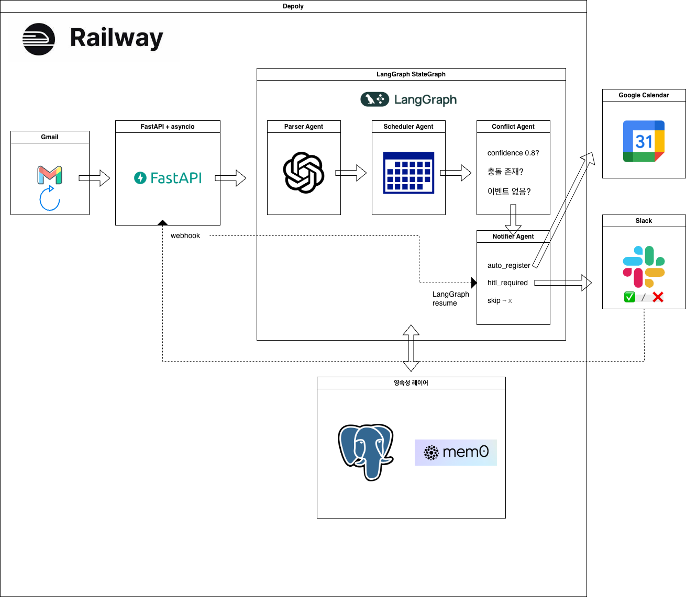

# dairinin (代理人)

---

## 🇯🇵 日本語

メールが届いたら、自動でGoogle Calendarに登録してくれる個人スケジュールAIエージェント。

> "何もしていないのに、カレンダーにもう登録されてた。"

### アーキテクチャ



### 主な機能

| 機能 | 説明 |
|------|------|
| **自動イベント解析** | GPT-4o-miniがメールを読んでタイトル・日時・場所・参加者を抽出 |
| **信頼度による分岐** | confidence ≥ 0.8で自動登録、未達なら確認依頼 |
| **スケジュール衝突検出** | 既存の予定と重複する場合、自動登録からHITLへ切替 |
| **Slack HITL** | 不確かなイベントはSlackボタン(✅/❌)で人間が最終判断 |
| **グラフ再開** | サーバー再起動後もSlackボタン押下で中断地点から正確に再開 |
| **パターン学習** | 自動承認されたイベントをmem0に保存 → 繰り返しパターンを認識 |
| **DRY_RUNモード** | 実際の登録前にログで精度検証が可能 |

### 技術スタック

| コンポーネント | 技術 |
|----------|------|
| オーケストレーション | LangGraph |
| LLM | GPT-4o-mini (LangChain) |
| APIサーバー | FastAPI + uvicorn |
| 外部連携 | FastMCP (Gmail, Calendar, Slack, mem0) |
| パターン学習 | mem0 + pgvector + Neo4j |
| DB | PostgreSQL (LangGraph checkpointer + HITL mapping) |
| デプロイ | Railway |
| パッケージ管理 | uv |

### 実行方法

```bash
git clone https://github.com/ias-kim/dairinin.git
cd dairinin

uv sync
cp .env.example .env
# .env にキーを入力

python scripts/get_gmail_token.py
docker compose up -d

uv run uvicorn app:app --reload
```

```bash
uv run pytest -v   # 63件、~9秒
```

---

## 🇰🇷 한국어

이메일이 오면 자동으로 Google Calendar에 등록해주는 개인 스케줄 AI 에이전트.

> "아무것도 안 했는데 캘린더에 이미 등록됨."

### 아키텍처


### 주요 기능

| 기능 | 설명 |
|------|------|
| **자동 이벤트 파싱** | GPT-4o-mini가 이메일을 읽고 제목, 날짜, 장소, 참석자를 추출 |
| **신뢰도 기반 분기** | confidence ≥ 0.8이면 자동 등록, 미달이면 사람에게 확인 요청 |
| **충돌 감지** | 기존 캘린더 일정과 겹치면 자동 등록 대신 HITL로 전환 |
| **Slack HITL** | 불확실한 이벤트는 Slack 버튼(✅/❌)으로 사람이 최종 결정 |
| **그래프 재개** | 서버 재시작 후에도 Slack 버튼 클릭 시 중단된 지점부터 재개 |
| **패턴 학습** | 자동 승인된 이벤트를 mem0에 저장 → 반복 패턴 인식 |
| **DRY_RUN 모드** | 실제 등록 전 로그로 정확도 검증 가능 |

### 기술 스택

| 컴포넌트 | 기술 |
|----------|------|
| 오케스트레이션 | LangGraph |
| LLM | GPT-4o-mini (LangChain) |
| API 서버 | FastAPI + uvicorn |
| 외부 연동 | FastMCP (Gmail, Calendar, Slack, mem0) |
| 패턴 학습 | mem0 + pgvector + Neo4j |
| DB | PostgreSQL (LangGraph checkpointer + HITL 매핑) |
| 배포 | Railway |
| 패키지 관리 | uv |

### 프로젝트 구조

```
dairinin/
├── app.py                  FastAPI + 폴링 루프 + Slack webhook
├── graph/
│   ├── state.py            ScheduleState
│   └── orchestrator.py     StateGraph (노드 연결 + 분기)
├── agents/
│   ├── parser.py           이메일 → EventJSON (LLM)
│   ├── scheduler.py        캘린더 충돌 체크
│   ├── conflict.py         auto / hitl / skip 판단
│   └── notifier.py         실행 + interrupt/resume
├── mcp_servers/
│   ├── gmail_mcp.py        Gmail API
│   ├── calendar_mcp.py     Google Calendar API
│   ├── slack_mcp.py        Slack HITL 메시지
│   └── memory_mcp.py       mem0 패턴 저장
├── db/
│   └── hitl_store.py       slack_ts ↔ thread_id 매핑
├── utils/
│   ├── models.py           EventJSON (Pydantic)
│   └── confidence.py       신뢰도 계산
└── tests/                  63개 테스트
```

### 실행 방법

```bash
git clone https://github.com/ias-kim/dairinin.git
cd dairinin

uv sync
cp .env.example .env
# .env에 키 입력

python scripts/get_gmail_token.py   # OAuth refresh_token 발급
docker compose up -d                # PostgreSQL + mem0

uv run uvicorn app:app --reload
```

```bash
uv run pytest -v   # 63개, ~9초
```

### 테스트 현황

```
63개 테스트 | ~9초 | Python 3.12

test_confidence.py       8개   신뢰도 계산
test_gmail_mcp.py        5개   Gmail fetch + mark_read
test_calendar_mcp.py    10개   일정 조회 + 충돌 감지 + 등록
test_memory_mcp.py       5개   패턴 저장/조회/격리
test_slack_mcp.py        3개   HITL 메시지 전송
test_parser_agent.py     4개   LLM 파싱 (mock)
test_scheduler_agent.py  4개   충돌 체크 + 타임존
test_conflict_agent.py   4개   판단 분기
test_notifier_agent.py   6개   auto/hitl/skip + interrupt
test_orchestrator.py     3개   전체 파이프라인 통합
test_hitl_store.py       8개   dedup + TTL + PostgreSQL 분기
test_app.py              3개   process_single_email
```
